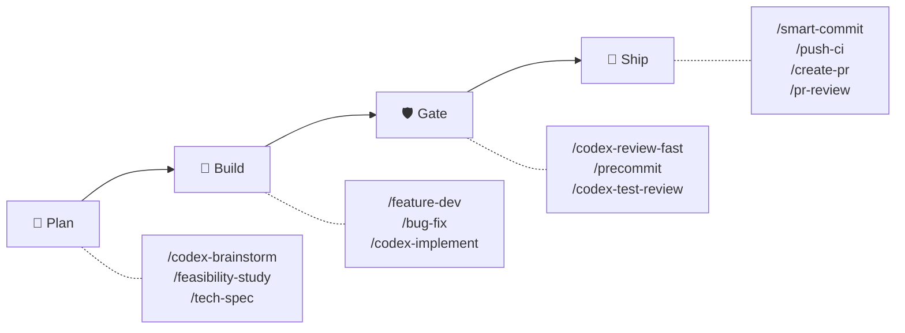
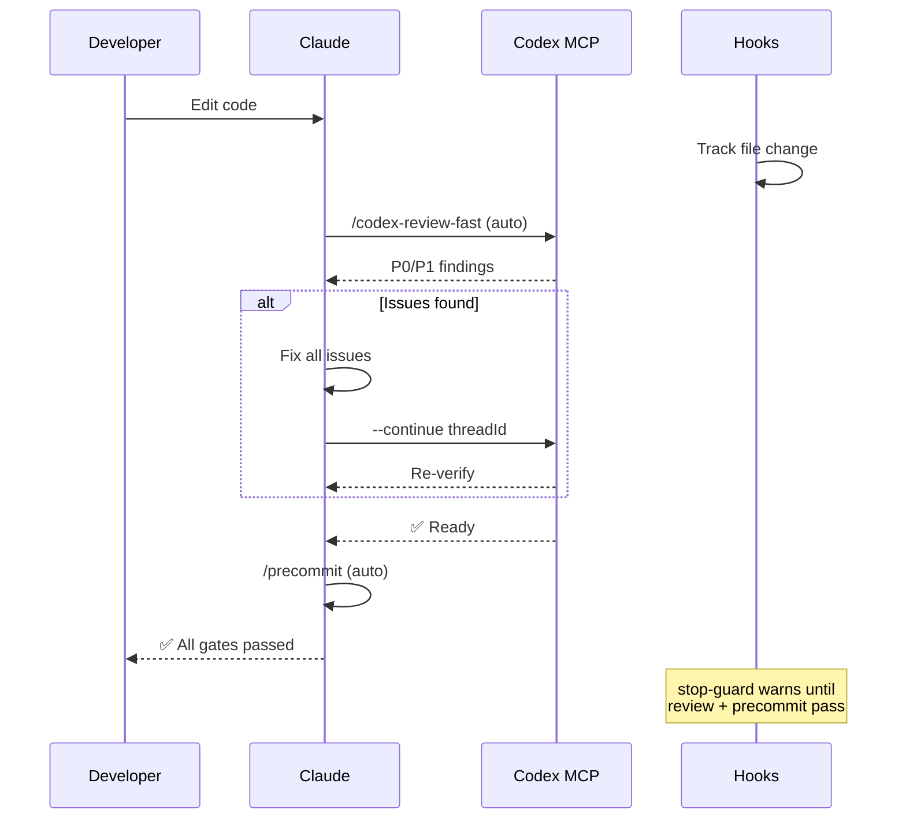

# sd0x-dev-flow

**Idioma**: [English](README.md) | [繁體中文](README.zh-TW.md) | [简体中文](README.zh-CN.md) | [日本語](README.ja.md) | [한국어](README.ko.md) | Español

**El motor de workflow de desarrollo autónomo para [Claude Code](https://claude.com/claude-code).**

Editar código → auto-review → auto-fix → gate-pass → entregar. Sin pasos manuales.

60 commands | 44 skills | 14 agents | ~4% de context footprint

## Cómo funciona



El **motor auto-loop** aplica quality gates automáticamente — tras cualquier edición de código, Claude dispara la revisión en la misma respuesta. Los hooks advierten sobre revisiones incompletas antes de detenerse (usar modo strict para bloquear).



## Instalación

```bash
# Agregar marketplace
/plugin marketplace add sd0xdev/sd0x-dev-flow

# Instalar plugin
/plugin install sd0x-dev-flow@sd0xdev-marketplace
```

**Requisitos**: Claude Code 2.1+ | [Codex MCP](https://github.com/openai/codex) (opcional, para comandos `/codex-*`)

## Inicio rápido

```bash
/project-setup
```

Un solo comando lo hace todo:

- Detecta framework, package manager, base de datos, entry points y scripts
- Configura `.claude/CLAUDE.md` con los parámetros del proyecto
- Instala 11 rules en `.claude/rules/` (auto-loop, security, testing, etc.)
- Instala 4 hooks en `.claude/hooks/` y los integra en `settings.json`

Usa `--lite` para solo configurar CLAUDE.md (sin rules/hooks).

## Tracks de workflow

```mermaid
flowchart TD
    subgraph feat ["🔨 Feature Development"]
        F1["/feature-dev"] --> F2["Code + Tests"]
        F2 --> F3["/verify"]
        F3 --> F4["/codex-review-fast"]
        F4 --> F5["/precommit"]
        F5 --> F6["/update-docs"]
    end

    subgraph fix ["🐛 Bug Fix"]
        B1["/issue-analyze"] --> B2["/bug-fix"]
        B2 --> B3["Fix + Regression test"]
        B3 --> B4["/verify"]
        B4 --> B5["/codex-review-fast"]
        B5 --> B6["/precommit"]
    end

    subgraph docs ["📝 Docs Only"]
        D1["Edit .md"] --> D2["/codex-review-doc"]
        D2 --> D3["Done"]
    end

    subgraph plan ["🎯 Planning"]
        P1["/codex-brainstorm"] --> P2["/feasibility-study"]
        P2 --> P3["/tech-spec"]
        P3 --> P4["/codex-architect"]
        P4 --> P5["Implementation ready"]
    end

    subgraph ops ["⚙️ Operations"]
        O1["/project-setup"] --> O2["/repo-intake"]
        O2 --> O3["Develop"]
        O3 --> O4["/project-audit"]
        O3 --> O7["/best-practices"]
        O3 --> O5["/risk-assess"]
        O4 --> O6["/next-step --go"]
        O5 --> O6
        O7 --> O6
    end
```



| Workflow | Comandos | Gate | Aplicado por |
|----------|----------|------|--------------|
| Funcionalidad | `/feature-dev` → `/verify` → `/codex-review-fast` → `/precommit` | ✅/⛔ | Hook + Comportamiento |
| Bug Fix | `/issue-analyze` → `/bug-fix` → `/verify` → `/precommit` | ✅/⛔ | Hook + Comportamiento |
| Auto-Loop | Edición de código → `/codex-review-fast` → `/precommit` | ✅/⛔ | Hook |
| Doc Review | Edición `.md` → `/codex-review-doc` | ✅/⛔ | Hook |
| Planificación | `/codex-brainstorm` → `/feasibility-study` → `/tech-spec` | — | — |
| Onboarding | `/project-setup` → `/repo-intake` | — | — |

## Contenido

| Categoría | Cantidad | Ejemplos |
|-----------|----------|----------|
| Commands | 60 | `/project-setup`, `/codex-review-fast`, `/verify`, `/smart-commit` |
| Skills | 44 | project-setup, code-explore, smart-commit, contract-decode |
| Agents | 14 | strict-reviewer, verify-app, coverage-analyst |
| Hooks | 5 | pre-edit-guard, auto-format, review state tracking, stop guard, namespace hint |
| Rules | 11 | auto-loop, codex-invocation, security, testing, git-workflow, self-improvement |
| Scripts | 7 | precommit runner, verify runner, dep audit, namespace hint, skill runner, commit-msg guard, pre-push gate |

### Mínimo consumo de context

~4% de la ventana de 200k tokens de Claude — el 96% queda disponible para tu código.

| Componente | Tokens | % de 200k |
|------------|--------|-----------|
| Rules (carga permanente) | 5.1k | 2.6% |
| Skills (bajo demanda) | 1.9k | 1.0% |
| Agents | 791 | 0.4% |
| **Total** | **~8k** | **~4%** |

Los skills se cargan bajo demanda. Los skills inactivos no consumen tokens.

## Referencia de comandos

### Desarrollo

| Comando | Descripción |
|---------|-------------|
| `/project-setup` | Autodetección y configuración del proyecto |
| `/repo-intake` | Escaneo inicial del proyecto (una sola vez) |
| `/install-rules` | Instalar reglas del plugin en `.claude/rules/` |
| `/install-hooks` | Instalar hooks del plugin en `.claude/` |
| `/install-scripts` | Instalar scripts de ejecución del plugin |
| `/bug-fix` | Workflow de corrección de bugs |
| `/codex-implement` | Codex escribe código |
| `/codex-architect` | Consultoría de arquitectura (tercer cerebro) |
| `/code-explore` | Exploración rápida del codebase |
| `/git-investigate` | Rastreo del historial de código |
| `/issue-analyze` | Análisis profundo de issues |
| `/post-dev-test` | Tests complementarios post-desarrollo |
| `/feature-dev` | Workflow de desarrollo (diseño → implementación → verificación → review) |
| `/feature-verify` | Diagnóstico de sistema (verificación de solo lectura, doble perspectiva) |
| `/code-investigate` | Investigación de código con doble perspectiva (Claude + Codex independientes) |
| `/next-step` | Asesor contextual de siguiente paso |
| `/smart-commit` | Commit inteligente por lotes (agrupar + mensaje + comandos) |
| `/push-ci` | Push (con aprobación) + monitoreo de CI |
| `/create-pr` | Crear GitHub PR desde branch |
| `/git-worktree` | Gestionar git worktrees |
| `/merge-prep` | Análisis y preparación pre-merge |
| `/smart-rebase` | Rebase parcial inteligente para repos con squash-merge |

### Review (Codex MCP)

| Comando | Descripción | Loop support |
|---------|-------------|--------------|
| `/codex-review-fast` | Review rápido (solo diff) | `--continue <threadId>` |
| `/codex-review` | Review completo (lint + build) | `--continue <threadId>` |
| `/codex-review-branch` | Review de branch completo | - |
| `/codex-cli-review` | Review CLI (lectura completa de disco) | - |
| `/codex-review-doc` | Review de documentación | `--continue <threadId>` |
| `/codex-security` | Auditoría OWASP Top 10 | `--continue <threadId>` |
| `/codex-test-gen` | Generar tests unitarios | - |
| `/codex-test-review` | Review de test coverage | `--continue <threadId>` |
| `/codex-explain` | Explicar código complejo | - |

### Verificación

| Comando | Descripción |
|---------|-------------|
| `/verify` | lint -> typecheck -> unit -> integration -> e2e |
| `/precommit` | lint:fix -> build -> test:unit |
| `/precommit-fast` | lint:fix -> test:unit |
| `/dep-audit` | Auditoría de seguridad de dependencias |
| `/project-audit` | Auditoría de salud del proyecto (puntuación determinista) |
| `/best-practices` | Auditoría de mejores prácticas de la industria (con debate adversarial) |
| `/risk-assess` | Evaluación de riesgos de código no commiteado |

### Planificación

| Comando | Descripción |
|---------|-------------|
| `/codex-brainstorm` | Brainstorming adversarial (equilibrio de Nash) |
| `/feasibility-study` | Análisis de viabilidad |
| `/tech-spec` | Generar tech spec |
| `/review-spec` | Revisar tech spec |
| `/deep-analyze` | Análisis profundo + roadmap |
| `/project-brief` | Resumen ejecutivo para PM/CTO |

### Documentación y herramientas

| Comando | Descripción |
|---------|-------------|
| `/update-docs` | Sincronizar docs con código |
| `/check-coverage` | Análisis de test coverage |
| `/create-request` | Crear/actualizar docs de requisitos |
| `/doc-refactor` | Simplificar documentación |
| `/simplify` | Simplificar código |
| `/de-ai-flavor` | Eliminar artefactos generados por IA de documentos |
| `/create-skill` | Crear nuevos skills |
| `/pr-review` | Self-review de PR |
| `/pr-summary` | Resumen de estado de PRs (agrupados por ticket) |
| `/contract-decode` | Decodificador de errores/calldata de contratos EVM |
| `/skill-health-check` | Validar calidad y routing de skills |
| `/statusline-config` | Personalizar segmentos y temas de la línea de estado |
| `/claude-health` | Verificación de configuración de Claude Code |
| `/op-session` | Inicializar sesión de 1Password CLI (evita solicitudes biométricas repetidas) |
| `/obsidian-cli` | Integración con vault de Obsidian vía CLI oficial |
| `/zh-tw` | Reescribir en chino tradicional |

## Rules

| Rule | Descripción |
|------|-------------|
| `auto-loop` | Fix -> re-review -> fix -> ... -> Pass (ciclo automático) |
| `codex-invocation` | Codex debe investigar independientemente, nunca alimentar conclusiones |
| `fix-all-issues` | Tolerancia cero: corregir todos los issues encontrados |
| `self-improvement` | Corrección → registrar lección → prevenir recurrencia |
| `framework` | Convenciones del framework (personalizables) |
| `testing` | Aislamiento Unit/Integration/E2E |
| `security` | Checklist OWASP Top 10 |
| `git-workflow` | Naming de branches, convenciones de commits |
| `docs-writing` | Tablas > párrafos, Mermaid > texto |
| `docs-numbering` | Prefijos de documentos (0-feasibility, 2-spec) |
| `logging` | JSON estructurado, sin secrets |

## Hooks

| Hook | Trigger | Propósito |
|------|---------|-----------|
| `namespace-hint` | SessionStart | Inyectar guía de namespace de comandos del plugin en el contexto de Claude |
| `post-edit-format` | Después de Edit/Write | Auto prettier + invalidar estado de review al editar |
| `post-tool-review-state` | Después de Bash / herramientas MCP | Tracking de estado de review (sentinel routing, soporte de comandos con namespace) |
| `pre-edit-guard` | Antes de Edit/Write | Prevenir edición de .env/.git |
| `stop-guard` | Antes de detener | Advertir si hay reviews incompletos + verificación stale-state git (default: warn) |

Los hooks son seguros por defecto. Variables de entorno para personalizar:

| Variable | Default | Descripción |
|----------|---------|-------------|
| `STOP_GUARD_MODE` | `warn` | Usar `strict` para bloquear stop si faltan pasos de review |
| `HOOK_NO_FORMAT` | (no definido) | `1` para desactivar auto-formateo |
| `HOOK_BYPASS` | (no definido) | `1` para saltar todos los checks de stop-guard |
| `HOOK_DEBUG` | (no definido) | `1` para mostrar info de debug |
| `GUARD_EXTRA_PATTERNS` | (no definido) | Regex para paths protegidos adicionales (ej. `src/locales/.*\.json$`) |

**Dependencias**: Los hooks requieren `jq`. El auto-formateo requiere `prettier`. Si faltan dependencias, se manejan de forma segura.

## Personalización

Ejecuta `/project-setup` para autodetectar y configurar todos los placeholders, o edita `.claude/CLAUDE.md` manualmente:

| Placeholder | Descripción | Ejemplo |
|-------------|-------------|---------|
| `{PROJECT_NAME}` | Nombre del proyecto | my-app |
| `{FRAMEWORK}` | Framework | MidwayJS 3.x, NestJS, Express |
| `{CONFIG_FILE}` | Archivo de config principal | src/configuration.ts |
| `{BOOTSTRAP_FILE}` | Entry de bootstrap | bootstrap.js, main.ts |
| `{DATABASE}` | Base de datos | MongoDB, PostgreSQL |
| `{TEST_COMMAND}` | Comando de tests | yarn test:unit |
| `{LINT_FIX_COMMAND}` | Auto-fix de lint | yarn lint:fix |
| `{BUILD_COMMAND}` | Comando de build | yarn build |
| `{TYPECHECK_COMMAND}` | Type checking | yarn typecheck |

## Arquitectura

```
Command (entrada) → Skill (capacidad) → Agent (entorno)
```

- **Commands**: El usuario los ejecuta con `/...`
- **Skills**: Knowledge bases cargadas bajo demanda
- **Agents**: Subagentes aislados con herramientas específicas
- **Hooks**: Guardrails automatizados (formateo, estado de review, stop guard)
- **Rules**: Convenciones siempre activas (carga automática)

Para detalles avanzados de arquitectura (agentic control stack, teoría de bucle de control, reglas de sandbox), consulta [docs/architecture.md](docs/architecture.md).

## Contribuir

PRs bienvenidos. Por favor:

1. Seguir las convenciones de naming existentes (kebab-case)
2. Incluir `When to Use` / `When NOT to Use` en skills
3. Agregar `disable-model-invocation: true` para operaciones peligrosas
4. Testear con Claude Code antes de enviar

## Licencia

MIT

## Star History

[](https://www.star-history.com/#sd0xdev/sd0x-dev-flow&type=date&legend=top-left)
