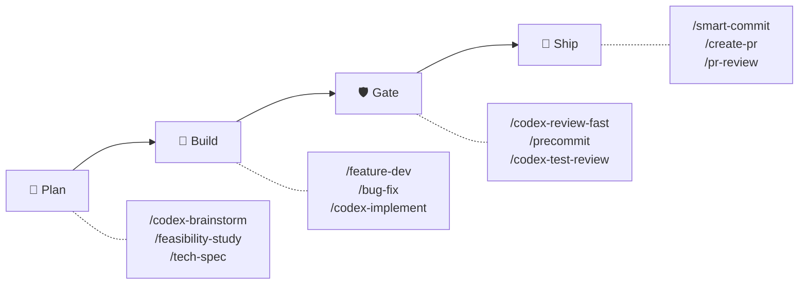
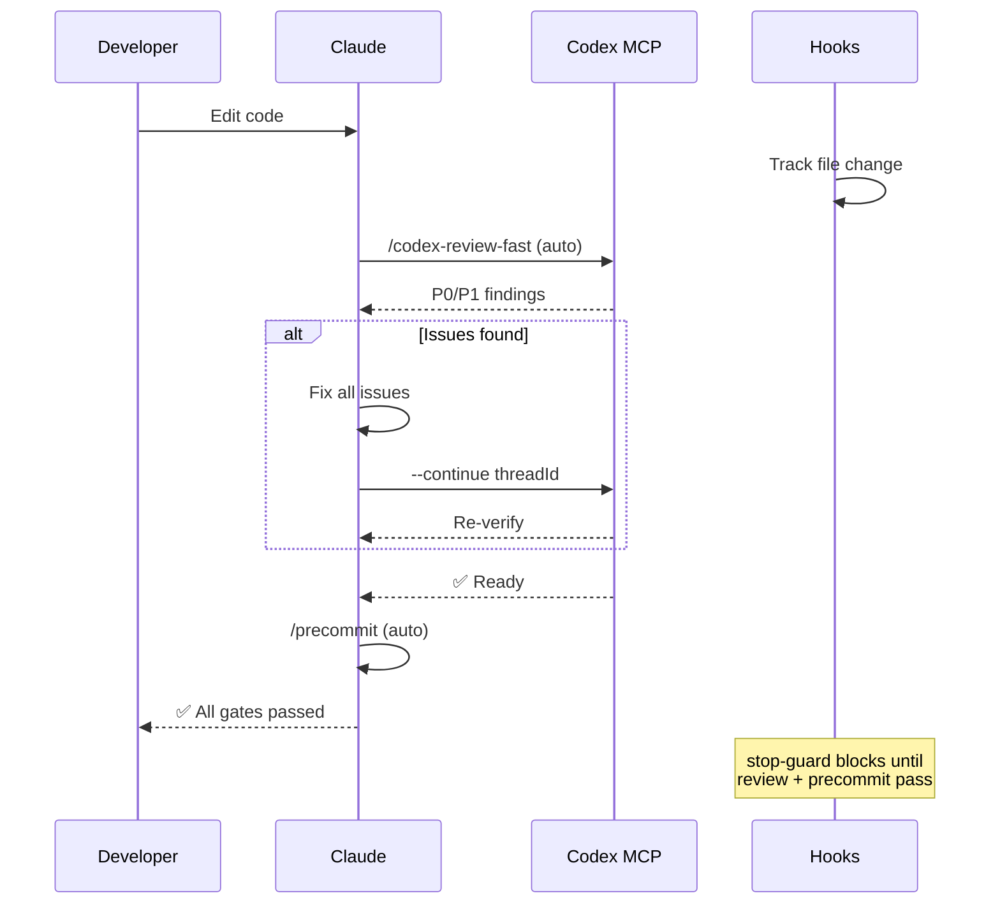

# sd0x-dev-flow

**言語**: [English](README.md) | [繁體中文](README.zh-TW.md) | [简体中文](README.zh-CN.md) | 日本語 | [한국어](README.ko.md) | [Español](README.es.md)

**[Claude Code](https://claude.com/claude-code) 向け自律型開発ワークフローエンジン。**

コード編集 → 自動レビュー → 自動修正 → ゲート通過 → 出荷。手動操作は不要です。

55 commands | 38 skills | 14 agents | ~4% context footprint

## 仕組み



**Auto-Loop エンジン**が品質ゲートを自動的に実行します。コード編集後、Claude は同じ返答内でレビューを開始し、すべてのゲートを通過するまで Hook が停止をブロックします。



## インストール

```bash
# marketplace を追加
/plugin marketplace add sd0xdev/sd0x-dev-flow

# プラグインをインストール
/plugin install sd0x-dev-flow@sd0xdev-marketplace
```

**必要環境**: Claude Code 2.1+ | [Codex MCP](https://github.com/openai/codex)（オプション、`/codex-*` コマンド用）

## クイックスタート

```bash
/project-setup
```

フレームワーク、パッケージマネージャー、データベース、エントリポイント、スクリプトコマンドを自動検出し、`.claude/CLAUDE.md` を更新します。

## ワークフロートラック

```mermaid
flowchart TD
    subgraph feat ["🔨 Feature Development"]
        F1["/feature-dev"] --> F2["Code + Tests"]
        F2 --> F3["/verify"]
        F3 --> F4["/codex-review-fast"]
        F4 --> F5["/precommit"]
        F5 --> F6["/update-docs"]
    end

    subgraph fix ["🐛 Bug Fix"]
        B1["/issue-analyze"] --> B2["/bug-fix"]
        B2 --> B3["Fix + Regression test"]
        B3 --> B4["/verify"]
        B4 --> B5["/codex-review-fast"]
        B5 --> B6["/precommit"]
    end

    subgraph docs ["📝 Docs Only"]
        D1["Edit .md"] --> D2["/codex-review-doc"]
        D2 --> D3["Done"]
    end

    subgraph plan ["🎯 Planning"]
        P1["/codex-brainstorm"] --> P2["/feasibility-study"]
        P2 --> P3["/tech-spec"]
        P3 --> P4["/codex-architect"]
        P4 --> P5["Implementation ready"]
    end

    subgraph ops ["⚙️ Operations"]
        O1["/project-setup"] --> O2["/repo-intake"]
        O2 --> O3["Develop"]
        O3 --> O4["/project-audit"]
        O3 --> O5["/risk-assess"]
        O4 --> O6["/next-step --go"]
        O5 --> O6
    end
```



| ワークフロー | コマンド | ゲート | 実行レイヤー |
|-------------|----------|------|-------------|
| 機能開発 | `/feature-dev` → `/verify` → `/codex-review-fast` → `/precommit` | ✅/⛔ | Hook + 動作レイヤー |
| バグ修正 | `/issue-analyze` → `/bug-fix` → `/verify` → `/precommit` | ✅/⛔ | Hook + 動作レイヤー |
| Auto-Loop | コード編集 → `/codex-review-fast` → `/precommit` | ✅/⛔ | Hook |
| ドキュメントレビュー | `.md` 編集 → `/codex-review-doc` | ✅/⛔ | Hook |
| プランニング | `/codex-brainstorm` → `/feasibility-study` → `/tech-spec` | — | — |
| オンボーディング | `/project-setup` → `/repo-intake` → `/install-rules` | — | — |

## 同梱内容

| カテゴリ | 数 | 例 |
|----------|-----|-----|
| コマンド | 55 | `/project-setup`, `/codex-review-fast`, `/verify`, `/smart-commit` |
| スキル | 38 | project-setup, code-explore, smart-commit, contract-decode |
| エージェント | 14 | strict-reviewer, verify-app, coverage-analyst |
| フック | 5 | pre-edit-guard, auto-format, review state tracking, stop guard, namespace hint |
| ルール | 11 | auto-loop, codex-invocation, security, testing, git-workflow, self-improvement |
| スクリプト | 5 | precommit runner, verify runner, dep audit, namespace hint, skill runner |

### 極小の Context 使用量

Claude の 200k context window のわずか ~4% — 96% はコードに使えます。

| コンポーネント | トークン数 | 200k に対する割合 |
|---------------|-----------|-----------------|
| ルール（常時読み込み） | 5.1k | 2.6% |
| スキル（オンデマンド） | 1.9k | 1.0% |
| エージェント | 791 | 0.4% |
| **合計** | **~8k** | **~4%** |

スキルはオンデマンドで読み込まれます。未使用のスキルはトークンを消費しません。

## コマンドリファレンス

### 開発

| コマンド | 説明 |
|----------|------|
| `/project-setup` | プロジェクトの自動検出・設定 |
| `/repo-intake` | プロジェクト初回スキャン（1回のみ） |
| `/install-rules` | プラグインルールを `.claude/rules/` にインストール |
| `/install-hooks` | プラグイン hooks を `.claude/` にインストール |
| `/install-scripts` | プラグインランナースクリプトをインストール |
| `/bug-fix` | バグ/Issue 修正ワークフロー |
| `/codex-implement` | Codex がコードを書く |
| `/codex-architect` | アーキテクチャ相談（第三の頭脳） |
| `/code-explore` | コードベースの高速探索 |
| `/git-investigate` | コード変更履歴の追跡 |
| `/issue-analyze` | Issue の深堀り分析 |
| `/post-dev-test` | 開発後のテスト補完 |
| `/feature-dev` | 機能開発ワークフロー（設計 → 実装 → 検証 → レビュー） |
| `/feature-verify` | システム診断（読み取り専用の検証、デュアル視点確認） |
| `/code-investigate` | デュアル視点コード調査（Claude + Codex 独立探索） |
| `/next-step` | コンテキスト認識型の次ステップアドバイザー |
| `/smart-commit` | スマートバッチコミット（グループ化 + メッセージ + コマンド） |
| `/create-pr` | ブランチから GitHub PR を作成 |
| `/git-worktree` | git worktree の管理 |
| `/merge-prep` | マージ前の分析と準備 |

### レビュー（Codex MCP）

| コマンド | 説明 | ループ対応 |
|----------|------|------------|
| `/codex-review-fast` | クイックレビュー（diff のみ） | `--continue <threadId>` |
| `/codex-review` | フルレビュー（lint + build） | `--continue <threadId>` |
| `/codex-review-branch` | ブランチ全体のレビュー | - |
| `/codex-cli-review` | CLI レビュー（ディスク全読み取り） | - |
| `/codex-review-doc` | ドキュメントレビュー | `--continue <threadId>` |
| `/codex-security` | OWASP Top 10 監査 | `--continue <threadId>` |
| `/codex-test-gen` | ユニットテスト生成 | - |
| `/codex-test-review` | テストカバレッジレビュー | `--continue <threadId>` |
| `/codex-explain` | 複雑なコードの解説 | - |

### 検証

| コマンド | 説明 |
|----------|------|
| `/verify` | lint -> typecheck -> unit -> integration -> e2e |
| `/precommit` | lint:fix -> build -> test:unit |
| `/precommit-fast` | lint:fix -> test:unit |
| `/dep-audit` | 依存パッケージのセキュリティ監査 |
| `/project-audit` | プロジェクトヘルス監査（決定論的スコアリング） |
| `/risk-assess` | 未コミットコードのリスク評価 |

### プランニング

| コマンド | 説明 |
|----------|------|
| `/codex-brainstorm` | 対立型ブレスト（ナッシュ均衡まで議論） |
| `/feasibility-study` | フィージビリティ分析 |
| `/tech-spec` | 技術仕様書の作成 |
| `/review-spec` | 技術仕様書のレビュー |
| `/deep-analyze` | 深堀り分析 + ロードマップ |
| `/project-brief` | PM/CTO 向けエグゼクティブサマリー |

### ドキュメント・ツール

| コマンド | 説明 |
|----------|------|
| `/update-docs` | ドキュメントとコードの同期 |
| `/check-coverage` | テストカバレッジ分析 |
| `/create-request` | 要件ドキュメントの作成/更新 |
| `/doc-refactor` | ドキュメントの簡素化 |
| `/simplify` | コードの簡素化 |
| `/de-ai-flavor` | AI 生成の痕跡を除去 |
| `/create-skill` | 新しいスキルの作成 |
| `/pr-review` | PR セルフレビュー |
| `/pr-summary` | PR ステータスサマリー（チケット別グループ） |
| `/contract-decode` | EVM コントラクトエラー/calldata デコーダー |
| `/skill-health-check` | スキル品質とルーティングの検証 |
| `/claude-health` | Claude Code 設定のヘルスチェック |
| `/op-session` | 1Password CLI セッションの初期化（繰り返しの生体認証を回避） |
| `/zh-tw` | 繁体字中国語に書き換え |

## ルール

| ルール | 説明 |
|--------|------|
| `auto-loop` | 修正 -> 再レビュー -> 修正 -> ... -> Pass（自動サイクル） |
| `codex-invocation` | Codex は独立調査必須、結論の注入禁止 |
| `fix-all-issues` | ゼロトレランス：見つけた問題はすべて修正 |
| `self-improvement` | 修正された → 教訓を記録 → 再発防止 |
| `framework` | フレームワーク固有の規約（カスタマイズ可） |
| `testing` | Unit/Integration/E2E の分離 |
| `security` | OWASP Top 10 チェックリスト |
| `git-workflow` | ブランチ命名・コミット規約 |
| `docs-writing` | テーブル > 段落、Mermaid > テキスト |
| `docs-numbering` | ドキュメント接頭辞規約（0-feasibility, 2-spec） |
| `logging` | 構造化 JSON、シークレット禁止 |

## フック

| フック | トリガー | 用途 |
|--------|----------|------|
| `namespace-hint` | SessionStart | プラグインコマンドの名前空間ガイダンスを Claude context に注入 |
| `post-edit-format` | Edit/Write 後 | 自動 prettier + 編集時にレビュー状態をリセット |
| `post-tool-review-state` | Bash / MCP ツール後 | レビュー状態の追跡（sentinel ルーティング、名前空間コマンド対応） |
| `pre-edit-guard` | Edit/Write 前 | .env/.git の編集を防止 |
| `stop-guard` | 停止前 | 未完了レビュー時に警告 + stale-state git チェック（デフォルト：warn） |

フックはデフォルトで安全です。環境変数で挙動をカスタマイズできます：

| 変数 | デフォルト | 説明 |
|------|------------|------|
| `STOP_GUARD_MODE` | `warn` | `strict` にするとレビュー手順不足時に停止をブロック |
| `HOOK_NO_FORMAT` | （未設定） | `1` で自動フォーマットを無効化 |
| `HOOK_BYPASS` | （未設定） | `1` で stop-guard チェックをすべてスキップ |
| `HOOK_DEBUG` | （未設定） | `1` でデバッグ情報を出力 |
| `GUARD_EXTRA_PATTERNS` | （未設定） | 追加で保護するパスの正規表現（例：`src/locales/.*\.json$`） |

**依存関係**：フックには `jq` が必要です。自動フォーマットには `prettier` が必要です。未導入の場合は自動的にスキップされます。

## カスタマイズ

`/project-setup` ですべてのプレースホルダーを自動検出・設定するか、`.claude/CLAUDE.md` を直接編集してください：

| プレースホルダー | 説明 | 例 |
|------------------|------|----|
| `{PROJECT_NAME}` | プロジェクト名 | my-app |
| `{FRAMEWORK}` | フレームワーク | MidwayJS 3.x, NestJS, Express |
| `{CONFIG_FILE}` | メイン設定ファイル | src/configuration.ts |
| `{BOOTSTRAP_FILE}` | ブートストラップエントリ | bootstrap.js, main.ts |
| `{DATABASE}` | データベース | MongoDB, PostgreSQL |
| `{TEST_COMMAND}` | テストコマンド | yarn test:unit |
| `{LINT_FIX_COMMAND}` | Lint 自動修正 | yarn lint:fix |
| `{BUILD_COMMAND}` | ビルドコマンド | yarn build |
| `{TYPECHECK_COMMAND}` | 型チェック | yarn typecheck |

## アーキテクチャ

```
Command (entry) → Skill (capability) → Agent (environment)
```

- **コマンド**：ユーザーが `/...` で起動
- **スキル**：オンデマンドで読み込まれるナレッジベース
- **エージェント**：専用ツールを持つ隔離されたサブエージェント
- **フック**：自動ガードレール（フォーマット、レビュー状態、ストップガード）
- **ルール**：常時有効な規約（自動読み込み）

高度なアーキテクチャの詳細（agentic control stack、制御ループ理論、サンドボックスルール）については [docs/architecture.md](docs/architecture.md) を参照してください。

## コントリビュート

PR を歓迎します。お願い事項：

1. 既存の命名規約に従う（kebab-case）
2. スキルに `When to Use` / `When NOT to Use` を含める
3. 危険な操作には `disable-model-invocation: true` を付与
4. 提出前に Claude Code でテスト

## ライセンス

MIT

## Star History

[](https://www.star-history.com/#sd0xdev/sd0x-dev-flow&type=date&legend=top-left)
