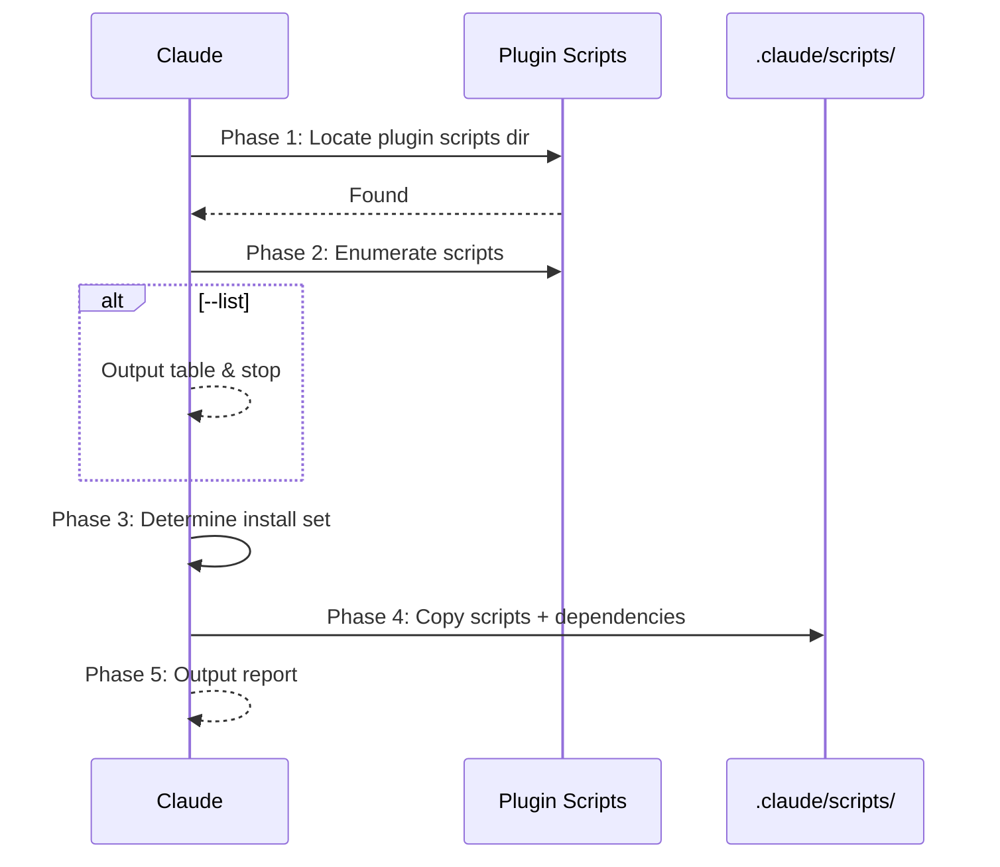

## Context

- Repo root: !`git rev-parse --show-toplevel`
- Existing local scripts: !`ls .claude/scripts/ 2>/dev/null || echo "(none)"`

## Task

Install sd0x-dev-flow plugin runner scripts into the current project's `.claude/scripts/` directory so they persist even without the plugin loaded. These scripts are used by `/precommit`, `/precommit-fast`, `/verify`, and `/dep-audit`.

### Workflow



### Arguments

```
$ARGUMENTS
```

| Argument | Description |
|----------|-------------|
| `--all` | Install all available core scripts |
| `--list` | List available core scripts without installing |
| `--dry-run` | Show what would be installed, no changes |
| `--force` | Overwrite existing scripts with different content |
| `--skill <name>` | Install all scripts from the specified skill |
| `--skill-all` | Install scripts from all skills |
| `--skill-list` | List all available skill scripts without installing |
| `script-names...` | Space-separated script names (without extension) |

### Phase 1: Locate Plugin Scripts Directory

Find the plugin's `scripts/` directory using this priority (short-circuit on first match):

1. **Glob search** — search known Claude plugin locations:

   ```
   Glob: ~/.claude/plugins/**/sd0x-dev-flow/scripts/precommit-runner.js
   Glob: ${REPO_ROOT}/node_modules/sd0x-dev-flow/scripts/precommit-runner.js
   ```

2. **Plugin-relative fallback** — try reading `@scripts/precommit-runner.js` to confirm accessibility. If readable, derive the scripts directory from the resolved path.
3. **Error** — if no scripts directory found, report error and stop.

### Phase 2: Enumerate Available Scripts

The available scripts and their dependencies are:

| Script | Type | Used By | Dependencies |
|--------|------|---------|--------------|
| `precommit-runner.js` | Node.js | `/precommit`, `/precommit-fast` | `lib/utils.js` |
| `verify-runner.js` | Node.js | `/verify` | `lib/utils.js` |
| `dep-audit.sh` | Bash | `/dep-audit` | None |
| `commit-msg-guard.sh` | Bash | git `commit-msg` hook | None |
| `lib/utils.js` | Node.js (shared) | Required by all `.js` runners | None (Node builtins only) |

If `--list` is specified, output this table and **stop**.

#### Skill Scripts

Dynamically enumerate scripts under `skills/*/scripts/*`. Known skill scripts:

| Script | Skill | Type | Dependencies |
|--------|-------|------|--------------|
| `op-session-init.sh` | op-session | Bash | None |
| `op-with-session.sh` | op-session | Bash | None |
| `pr-summary.sh` | pr-summary | Bash | `jq` |
| `pre-merge-check.sh` | merge-prep | Bash | None |
| `review.sh` | codex-cli-review | Bash | None |
| `skill-lint.js` | skill-health-check | Node.js | None |
| `audit.js` | project-audit | Node.js | None |
| `analyze.js` | next-step | Node.js | None |
| `risk-analyze.js` | risk-assess | Node.js | None |
| `scan_midway_delta.js` | repo-intake | Node.js | None |
| `intake_cached.js` | repo-intake | Node.js | None |
| `scan_midway_repo.js` | repo-intake | Node.js | None |

If `--skill-list` is specified, output this skill scripts table and **stop**.

### Phase 3: Determine Installation Set

- `--all`: install all core scripts + dependencies
- `--skill <name>`: install all scripts under the specified skill
- `--skill-all`: install all skill scripts from every skill
- Specific `script-names`: install those + required dependencies (auto-include `lib/utils.js` when any `.js` runner is selected). Validate names exist in Phase 2 table; error on unknown names.
- Neither: present the list and use AskUserQuestion to let the user select
- Combinations: `--all --skill op-session` installs core scripts + the specified skill scripts

### Phase 4: Copy Scripts

Use `REPO_ROOT` from `git rev-parse --show-toplevel` for all absolute paths.

If `--dry-run`, compute the install plan without writing any files, output the plan table, and **stop**.

1. Ensure target directories exist:

   ```bash
   # For core scripts
   mkdir -p ${REPO_ROOT}/.claude/scripts/lib
   # For skill scripts (when --skill or --skill-all)
   mkdir -p ${REPO_ROOT}/.claude/scripts/skills/<skill-name>
   ```

   > **Note**: Installed skill scripts serve as local copies for direct invocation (e.g. `bash .claude/scripts/skills/op-session/op-session-init.sh`). They are not consumed by `run-skill.sh`, which resolves from the plugin's own `skills/` directory.

2. For each script to install:

   | Scenario | Default | `--force` |
   |----------|---------|-----------|
   | Target does not exist | **Copy** | **Copy** |
   | File exists, content identical | **Skip** (already installed) | **Skip** |
   | File exists, content differs | **Skip** + warn as conflict | **Overwrite** |

3. After copying bash scripts (core and skill): `chmod +x` all `.sh` files

### Phase 5: Output Report

## Output

```markdown
## Install Scripts Report

**Source**: <plugin-scripts-path>
**Target**: <repo-root>/.claude/scripts/

| Script | Status |
|--------|--------|
| precommit-runner.js | ✅ Copied |
| verify-runner.js | ✅ Copied |
| dep-audit.sh | ✅ Copied |
| lib/utils.js | ✅ Copied |

**Installed**: N / **Skipped**: M / **Conflicts**: K

### Next Steps

- Runner scripts are now available at `.claude/scripts/`
- Commands `/precommit`, `/precommit-fast`, `/verify`, `/dep-audit` will auto-detect them
- Use `--force` to upgrade scripts when plugin updates
```

## Examples

```bash
# List available core scripts
/install-scripts --list

# List available skill scripts
/install-scripts --skill-list

# Install all core scripts
/install-scripts --all

# Install specific scripts only
/install-scripts precommit-runner verify-runner

# Install a specific skill's scripts
/install-scripts --skill op-session

# Install all skill scripts
/install-scripts --skill-all

# Mix: core + specific skill
/install-scripts --all --skill op-session

# Preview what would happen
/install-scripts --all --dry-run

# Force overwrite existing scripts
/install-scripts --all --force
```
