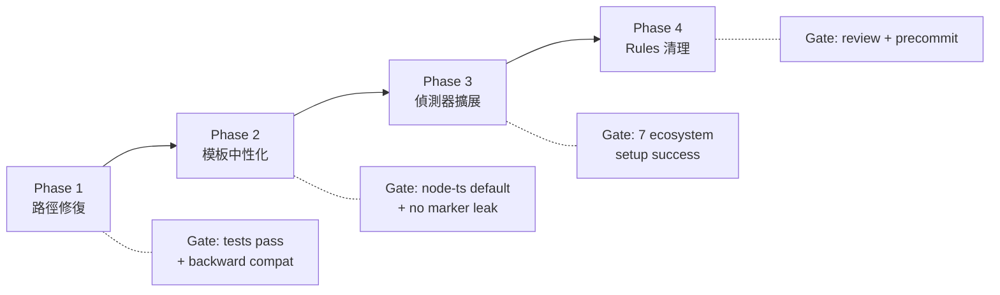

# Multi-Ecosystem Support for Open-Source Users

> **Created**: 2026-02-19
> **Status**: Pending
> **Priority**: P1
> **Tech Spec**: (pending — run `/tech-spec` to generate)

## Background

sd0x-dev-flow 作為開源 Claude Code 插件，目前約 70% 的內容鎖定在 JS/TS 生態系。CLAUDE.md 模板包含 MidwayJS-specific Footguns、TypeScript/Redis/Jest Tech Stack、`src/` → `test/unit/` 測試映射。`/project-setup` 偵測邏輯僅支援 Node.js（SKILL.md 第 17 行明確排除非 Node/TS）。開源使用者可能使用 Python、Rust、Go、Ruby、Java，這些使用者在 onboarding 時會遇到失敗或誤導性指引。

**來源**: Claude + Codex 對抗式 brainstorm（3 輪辯論，Nash Equilibrium 達成）。

**JS/TS 鎖定比例量測方式**: CLAUDE.md 9 個 section 中有 5 個含 JS/TS-specific 內容（Tech Stack、Key Entrypoints、Footguns、Test Requirements、framework.md 引用）；10 個 rules 中 2 個 JS-specific（framework.md、testing.md 部分）；hooks 格式化硬編碼 prettier。合計 ~70%（按元件影響範圍）。

## Rollout

## Requirements

### Phase 1: 路徑修復 + 執行斷裂消除（最高痛點）

- 修復 5 個 command 檔案中 8 處 `node skills/...` 直接呼叫（plugin 全局安裝後路徑斷裂）
  - `commands/next-step.md`
  - `commands/project-audit.md`
  - `commands/repo-intake.md`
  - `commands/risk-assess.md`
  - `commands/skill-health-check.md`
- 修復 5 個 skill SKILL.md 檔案中的 `node skills/...` 引用（同源問題）
  - `skills/next-step/SKILL.md`
  - `skills/project-audit/SKILL.md`
  - `skills/risk-assess/SKILL.md`
  - `skills/repo-intake/SKILL.md`
  - `skills/skill-health-check/SKILL.md`
- 標準化腳本路徑解析順序：local `.claude/scripts/` → plugin root → `node_modules/`
- 更新受影響 command 的 `allowed-tools` 路徑權限，匹配新的解析路徑
- 新增 `scripts/namespace-hint.sh` 第二行輸出 plugin 資產路徑查找指引（更新 `test/scripts/namespace-hint.test.js` 測試契約以支援多行輸出）
- `/project-setup` 加入非 Node 防護：偵測到非 JS/TS 生態系時，顯示明確提示而非套用 JS 模板
- 修復 `commands/verify.md` 的 `allowed-tools`：文件記載多生態系 fallback 但工具權限僅限 Node

### Phase 2: 模板中性化

- 新增 `CLAUDE.template.md`（source template with tagged blocks），原 `CLAUDE.md` 不變（backward compat）
- Marker 語法：`<!-- block:node-ts -->...<!-- /block -->`（僅存在於 template，不進入 rendered output）
- 渲染目標：一律寫入 `.claude/CLAUDE.md`（project-local config）
- `/project-setup` 流程：讀取 `CLAUDE.template.md`（若不存在則 fallback `CLAUDE.md`）→ 生態系篩選 → 填入 placeholders → 移除 markers → 寫入 `.claude/CLAUDE.md`
- 更新所有引用渲染目標的文件（對齊 `.claude/CLAUDE.md`）：`commands/project-setup.md`、`skills/project-setup/SKILL.md`、`skills/codex-implement/SKILL.md`、README 系列。定義優先順序：`.claude/CLAUDE.md`（若存在）> `CLAUDE.md`
- 通用區段保留：Required Checks、Workflow、Auto-Loop Rule、Command Quick Reference
- 生態系區段條件化：Tech Stack、Key Entrypoints、Footguns、Test Requirements

### Phase 3: project-setup 偵測器適配

- 擴展 `skills/project-setup/references/detection-rules.md` 支援 Python/Go/Rust/Ruby/Java
- 新增偵測：`pyproject.toml` / `go.mod` / `Cargo.toml` / `Gemfile` / `pom.xml` / `build.gradle` / `build.gradle.kts`
- 新增 framework 偵測：Flask/Django/FastAPI、Gin/Echo、Actix/Rocket、Rails/Sinatra、Spring Boot
- 新增 entrypoint 偵測：`main.py`、`main.go`、`main.rs`、`app.rb`、`Main.java`、`*Application.java`

### Phase 4: Rules 清理

- `rules/framework.md`：中性化為 ecosystem-neutral baseline，JS/TS 內容移入 overlay
- `rules/testing.md`：移除 `TEST_ENV` 假設，加入多生態系測試模式
- `rules/security.md`：加入多生態系審計命令（pip-audit、govulncheck、cargo audit、bundle audit）
- `/project-setup` 決定渲染到 `.claude/CLAUDE.md` 的 Rules 引用中包含哪些 overlay

## Scope

| Scope | Description |
|-------|-------------|
| In | 路徑解析修復、模板中性化、偵測器擴展、rules 清理 |
| Out | 新增 language-specific skill references（如 test-patterns-python.md）、hooks formatter 多語言化（post-edit-format.sh 的 prettier → 生態系感知） |

## Related Files

| File | Action | Description |
|------|--------|-------------|
| `commands/next-step.md` | Modify | 修復 `node skills/...` 路徑 |
| `commands/project-audit.md` | Modify | 修復 `node skills/...` 路徑 |
| `commands/repo-intake.md` | Modify | 修復 `node skills/...` 路徑 |
| `commands/risk-assess.md` | Modify | 修復 `node skills/...` 路徑 |
| `commands/skill-health-check.md` | Modify | 修復 `node skills/...` 路徑 + allowed-tools |
| `commands/verify.md` | Modify | 修復 allowed-tools 權限 |
| `skills/next-step/SKILL.md` | Modify | 修復 `node skills/...` 引用 |
| `skills/project-audit/SKILL.md` | Modify | 修復 `node skills/...` 引用 |
| `skills/risk-assess/SKILL.md` | Modify | 修復 `node skills/...` 引用 |
| `skills/repo-intake/SKILL.md` | Modify | 修復 `node skills/...` 引用 |
| `skills/skill-health-check/SKILL.md` | Modify | 修復 `node skills/...` 引用 |
| `scripts/namespace-hint.sh` | Modify | 加入 plugin 資產路徑指引（多行輸出） |
| `test/scripts/namespace-hint.test.js` | Modify | 更新測試契約支援多行輸出（每行 <100 字元） |
| `CLAUDE.template.md` | New | Source template with tagged blocks |
| `skills/project-setup/SKILL.md` | Modify | 非 Node 防護 + 多生態系偵測 + 渲染目標對齊 `.claude/CLAUDE.md` |
| `commands/project-setup.md` | Modify | 渲染目標對齊 `.claude/CLAUDE.md` |
| `skills/codex-implement/SKILL.md` | Modify | CLAUDE.md 引用對齊 |
| `README.md` | Modify | project-setup 描述對齊 `.claude/CLAUDE.md` |
| `README.zh-TW.md` | Modify | 同上（繁體中文） |
| `README.zh-CN.md` | Modify | 同上（簡體中文） |
| `README.ja.md` | Modify | 同上（日本語） |
| `README.ko.md` | Modify | 同上（한국어） |
| `README.es.md` | Modify | 同上（Español） |
| `skills/project-setup/references/detection-rules.md` | Modify | 擴展偵測規則到 7 個生態系 |
| `rules/framework.md` | Modify | 中性化 baseline |
| `rules/testing.md` | Modify | 多生態系測試模式 |
| `rules/security.md` | Modify | 多生態系審計命令 |

## Acceptance Criteria

### Phase 1

- [ ] 5 個 command 檔案 + 5 個 skill SKILL.md 的 `node skills/...` 路徑正確解析（plugin global 安裝場景）
- [ ] 受影響 command 的 `allowed-tools` 更新匹配新解析路徑
- [ ] SessionStart hint 包含 plugin 資產路徑查找指引（多行輸出，每行 <100 字元）
- [ ] `test/scripts/namespace-hint.test.js` 更新為每行 <100 字元契約（取代單行整體 <100 限制）
- [ ] `/project-setup` 偵測到非 Node 生態系時輸出明確提示（不套用 JS 模板）
- [ ] `commands/verify.md` allowed-tools 包含非 Node 工具執行權限
- [ ] 現有 tests 全部通過（backward compatibility）

### Phase 2

- [ ] 新增 `CLAUDE.template.md` 作為 source template（含 tagged blocks）
- [ ] `/project-setup` 讀取 `CLAUDE.template.md`（fallback `CLAUDE.md`）→ 生態系篩選 → 填入 placeholders → 移除 markers → 寫入 `.claude/CLAUDE.md`
- [ ] 渲染後的 `.claude/CLAUDE.md` 無殘留 `<!-- block:... -->` markers
- [ ] 所有引用渲染目標的文件對齊 `.claude/CLAUDE.md`（project-setup.md、SKILL.md、codex-implement SKILL.md、README）
- [ ] Node/TS 使用者體驗不變（default profile = node-ts）

### Phase 3

- [ ] detection-rules.md 覆蓋 Node/Python/Go/Rust/Ruby/Java 七個生態系
- [ ] Python 專案可成功執行 `/project-setup`（偵測 pyproject.toml、替換 placeholders）
- [ ] Go 專案可成功執行 `/project-setup`（偵測 go.mod）
- [ ] Rust 專案可成功執行 `/project-setup`（偵測 Cargo.toml）
- [ ] Ruby 專案可成功執行 `/project-setup`（偵測 Gemfile）
- [ ] Java 專案可成功執行 `/project-setup`（偵測 pom.xml / build.gradle / build.gradle.kts）

### Phase 4

- [ ] `rules/framework.md` 不含 MidwayJS-specific 內容
- [ ] `rules/testing.md` 支援多生態系測試慣例
- [ ] `rules/security.md` 包含各生態系審計命令
- [ ] Pass `/codex-review-fast`
- [ ] Pass `/precommit`

## Progress

| Phase | Status | Note |
|-------|--------|------|
| Analysis | Done | Claude + Codex brainstorm 3 輪，Nash Equilibrium 達成 |
| Development | - | |
| Testing | - | |
| Acceptance | - | |

## References

- Brainstorm: 2026-02-19 Claude + Codex 對抗式 brainstorm（3 輪辯論）
- Codex threadId: `019c75e0-cd89-7652-8b04-de7c5c1319af`
- 前置工作: [Command Namespace Resolution](../../plugin-namespace/requests/2026-02-13-command-namespace-resolution.md)（已完成，為 Phase 1 基礎）
- Plugin SKILL.md:17: "Non Node.js/TypeScript project — detection logic targets JS/TS ecosystem"
- Precommit 多生態系支援: `commands/precommit.md` lines 51-57（Python/Rust/Go/Java/Ruby fallback）
- Codex 發現: 8 處 `node skills/...` 在 5 個 command 檔案中
