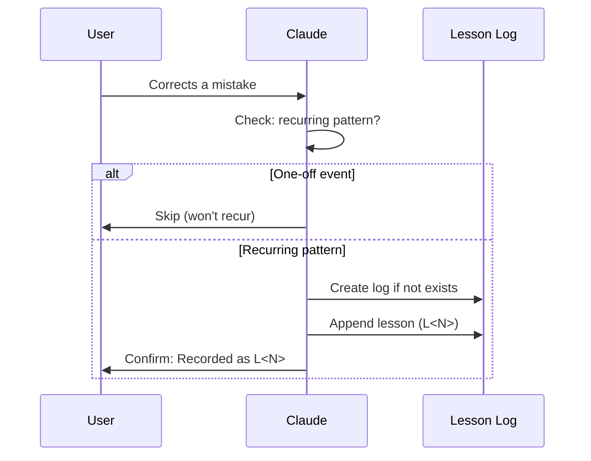
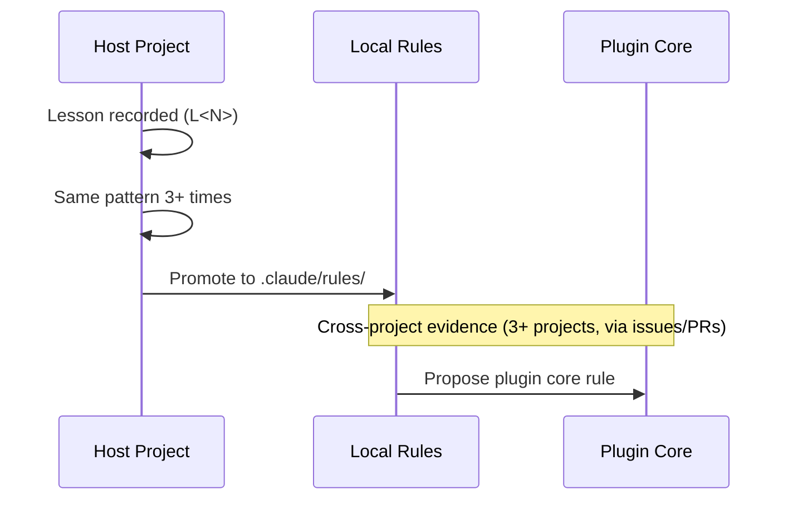

# Self-Improvement Loop

**Corrected → record lesson → prevent recurrence**

## Trigger Conditions

| Trigger | Action |
|---------|--------|
| User corrects a mistake | Evaluate and record (see Recording Workflow) |
| Same pattern appears 3+ times | Promote to formal rule or update existing rule |
| User requests consolidation | Review and clean up lessons |

## Recording Workflow



| Step | Check | Outcome |
|------|-------|---------|
| 1. Correction received | Is this a recurring pattern (not one-off)? | If one-off → skip |
| 2. Check lesson log | Does `.claude/sd0x-dev-flow-lessons.md` exist? | If no → create it |
| 3. Record lesson | Append using Lesson Format below | Confirm to user |

## Lesson Format

Append each lesson to the host project's lesson log (Tier B, see below):

```markdown
### L<number> — <brief description>

- **Context**: What situation led to the mistake
- **Error pattern**: What was done (or not done) incorrectly
- **Correct approach**: What should be done instead
- **Prevention**: Detection signal or automation measure
- **Source**: Date + conversation summary (redacted, see below)
```

### Source Field Redaction

| Keep | Strip |
|------|-------|
| Date (`2026-02-24`) | API keys, tokens, passwords |
| File paths, function names | Internal URLs with credentials |
| Error type description | User personal data |
| Conversation topic summary | Full stack traces with secrets |

Example: `2026-02-24 — Deleted rules/docs-writing.md instead of .claude/rules/docs-writing.md during duplicate cleanup`

## Two-Tier Model

| Tier | Purpose | Location | Default |
|------|---------|----------|---------|
| **A (process)** | This rule — defines how to record and manage lessons | `rules/self-improvement.md` | Always on |
| **B (state)** | Lesson log — accumulated lessons per host project | `.claude/sd0x-dev-flow-lessons.md` | Auto on first recurring correction |

Tier B is **auto-created on first recurring correction**: the lesson log is created when a recurring pattern is detected.
Namespace the file (`sd0x-dev-flow-lessons.md`) to avoid collisions with other plugins.

## Management Rules

| Rule | Description |
|------|-------------|
| Max 20 active lessons | Active = not yet promoted to a rule and not archived. Consolidate when exceeded: merge similar, archive rule-covered |
| Promote to rule | Same pattern 3+ times (manual judgment) → extract to `rules/` → mark lesson as promoted |
| No one-off events | Only record patterns that can recur (see Recording Workflow) |
| No secrets/PII | Never record tokens, keys, passwords, or personal data (see Source Redaction) |
| Periodic consolidation | On user request; run `/codex-review-doc` (or namespaced variant) after consolidation |

## Promotion Path



## Prohibited Behaviors

```
❌ Being corrected on a recurring pattern and not recording
❌ Vague lessons ("be careful with X" → must specify context and correct approach)
❌ Recording one-off events that won't recur
❌ Storing lessons in CLAUDE.md (use separate lesson log)
❌ Recording secrets, tokens, or PII in lesson source
```

## Correct Behaviors

```
✅ "Recorded as L5 — always check file exists before deleting"
✅ "This is the 3rd time; promoting to a rule..."
✅ "Consolidating: L2 and L7 are same pattern, merging..."
✅ "One-off typo correction — not recording (won't recur)"
```

## Relationship to Other Rules

| Rule | Relationship |
|------|-------------|
| `fix-all-issues.md` | Complementary: fix handles "repair now", lessons handle "remember why and prevent" |
| `auto-loop.md` | No conflict: lessons do not affect the review/precommit loop |
| `codex-invocation.md` | Lessons can capture Codex prompt design mistakes |

## .gitignore Guidance

Users should decide whether to track lessons in version control:

```gitignore
# Option A: Untracked (personal memory, not shared)
.claude/sd0x-dev-flow-lessons.md

# Option B: Tracked (shared team memory)
# Do not add to .gitignore
```
