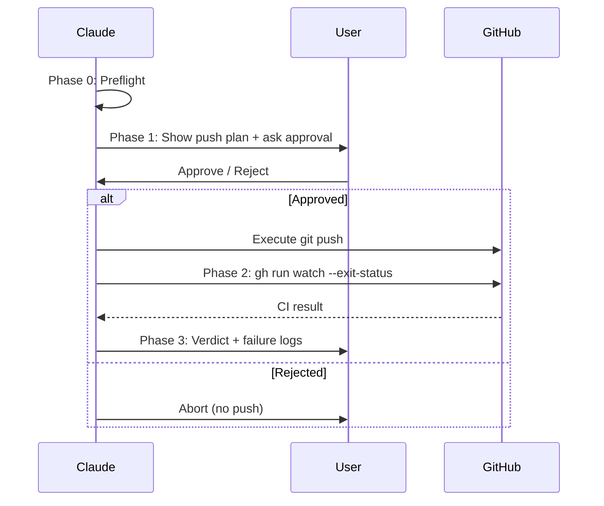

# Push & CI Monitor

Push to remote with user approval, then monitor CI run until completion.

## Authorization

```
⚠️ This skill is the ONLY authorized path for Claude to execute `git push`.
⚠️ All other skills and rules MUST output push commands only (not execute).
⚠️ Push REQUIRES explicit user approval via AskUserQuestion — no exceptions.
```

| Rule | This Skill | All Other Skills |
|------|-----------|-----------------|
| `git push` | Execute (after user approval) | Forbidden (output only) |
| `git push --force` | Forbidden | Forbidden |
| Push to main/master | Blocked (preflight rejects) | Forbidden |

## Workflow



### Phase 0: Preflight

Run all checks. Abort on any failure.

```bash
# 1. Current branch
BRANCH=$(git rev-parse --abbrev-ref HEAD)

# 2. Protected branch guard
# Abort if on main, master, develop, or release/*
# (never push directly to protected branches)

# 3. Remote exists
git ls-remote --exit-code origin >/dev/null 2>&1

# 4. Working tree status
git status --short

# 5. Commits ahead of remote
git rev-list --count origin/$BRANCH..HEAD 2>/dev/null || echo "new branch"

# 6. Local HEAD SHA (for CI run matching later)
HEAD_SHA=$(git rev-parse HEAD)
```

| Check | Pass | Fail |
|-------|------|------|
| Branch is not protected | Continue | Abort: "Cannot push directly to `<branch>`" |
| Remote exists | Continue | Abort: "No remote 'origin' configured" |
| Has commits ahead | Continue | Abort: "Nothing to push (0 commits ahead)" |

### Phase 1: Push Plan + User Approval

Present push summary and **ask user for explicit approval** using AskUserQuestion:

```markdown
## Push Plan

- Branch: `<branch>`
- Remote: `origin`
- Commits: <N> ahead
- HEAD: `<sha>`

Command to execute: `git push origin <branch>`
```

**Gate**: Use AskUserQuestion with options:
- "Approve push" — proceed to execute
- "Abort" — stop, do not push

**If user rejects → stop immediately. Do NOT retry or persuade.**

### Phase 2: Execute Push + Monitor CI

After user approval:

**Command assembly** (deterministic):

```bash
# 1. Build push command from arguments
CMD="git push"
if [[ "$FORCE_WITH_LEASE" == "true" ]]; then CMD="$CMD --force-with-lease"; fi
if [[ "$SET_UPSTREAM" == "true" ]]; then CMD="$CMD -u"; fi
CMD="$CMD origin $BRANCH"
# e.g.: git push -u origin feat/auth
# e.g.: git push --force-with-lease origin feat/rebase

# 2. Execute push (ONLY after explicit approval)
$CMD

# 3. Find CI run matching HEAD_SHA
gh run list --branch $BRANCH --limit 5 --json databaseId,headSha,status,name \
  --jq ".[] | select(.headSha == \"$HEAD_SHA\")"

# 4. Monitor with timeout
gh run watch <run-id> --exit-status
# Claude must enforce --timeout by checking elapsed time;
# if timeout exceeded, stop watching and report ⚠️ Timeout.
```

**`--set-upstream` auto-detect**: If `git rev-parse --abbrev-ref --symbolic-full-name @{u}` fails (no upstream), add `-u` automatically.

**CI Run Selection** — match by `headSha + branch`, not "latest" (see step 3 above).

If no run found after 30 seconds, retry up to 3 times (10s interval). If still not found:

```
⚠️ No CI run detected for SHA <sha>. Possible causes:
- No workflow configured for this branch
- Path-filtered workflow didn't trigger
- Check: gh run list --branch <branch>
```

**Timeout**: Default 10 minutes. Configurable via `--timeout <minutes>`.

### Phase 3: Verdict

| CI Result | Action |
|-----------|--------|
| Pass | Output: "✅ CI passed — `<run-url>`" |
| Fail | Output: failing jobs + `gh run view <id> --log-failed` summary |
| Timeout | Output: "⚠️ CI still running after <N>min — `gh run watch <id>`" |

## Arguments

| Argument | Description | Default |
|----------|-------------|---------|
| `--timeout <min>` | CI watch timeout in minutes | 10 |
| `--force-with-lease` | Use `--force-with-lease` instead of regular push | off |
| `--set-upstream` | Add `-u` flag (first push of new branch) | auto-detect |

**`--force` is NOT supported.** Force push is always forbidden.

## Prohibited

```
- Executing git push WITHOUT prior user approval via AskUserQuestion
- Suggesting or executing git push --force (ever)
- Pushing to main, master, develop, or release/* branches
- Auto-triggering this skill (disable-model-invocation: true)
- Skipping preflight checks
- Monitoring wrong CI run (must match HEAD SHA)
```

## Verification

- [ ] Preflight passed (branch + remote + commits)
- [ ] User approved push via AskUserQuestion
- [ ] Push executed successfully
- [ ] CI run matched by HEAD SHA (not "latest")
- [ ] Verdict reported (pass/fail/timeout)

## Examples

```
Input: /push-ci
Phase 0: Preflight — branch feat/auth, 3 commits ahead, remote OK
Phase 1: Show plan → user approves
Phase 2: git push origin feat/auth → gh run watch 12345 --exit-status
Phase 3: ✅ CI passed — https://github.com/.../actions/runs/12345
```

```
Input: /push-ci --timeout 15
Phase 0-1: Same as above
Phase 2: Monitor with 15-minute timeout
Phase 3: Verdict
```

```
Input: /push-ci --force-with-lease
Phase 0: Preflight (still rejects protected branches)
Phase 1: Show plan with --force-with-lease → user approves
Phase 2: git push --force-with-lease origin feat/rebase-cleanup
Phase 3: CI monitoring
```
