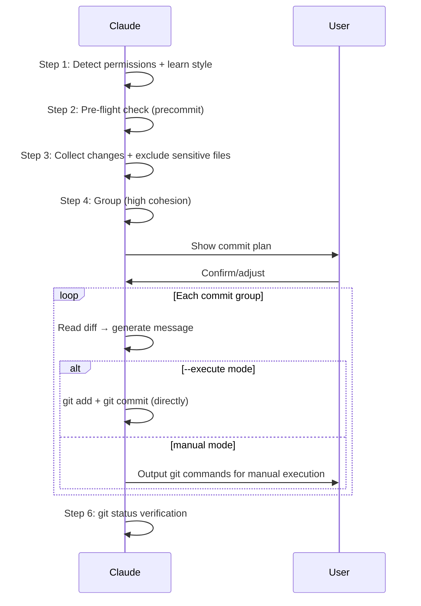

# Smart Commit

Analyze uncommitted changes → group by cohesion → generate commit messages → output git commands (or execute directly with `--execute`).

## Workflow



### Step 1: Detect Permissions + Learn Style

**1a. Permission Detection**

Read CLAUDE.md and `.claude/rules/git-workflow.md` to determine mode:

| Mode | Condition | Behavior |
|------|-----------|----------|
| manual | No `--execute` flag (default) | Output commands only |
| execute | `--execute` flag passed | Execute directly (with user approval via AskUserQuestion) |

Default to **manual mode**. Direct execution requires explicit `--execute` flag regardless of project git restrictions.

**`--execute` mode**: When `--execute` is passed, use `AskUserQuestion` to show the full commit plan and get explicit user approval before executing. This is a skill-level exception to git-workflow rules (same pattern as `/push-ci`).

**1b. Learn Commit Style**

```bash
git log --oneline -15
```

Infer format, type vocabulary, subject conventions (capitalization/tense/ticket ID), and language from recent commits.

### Step 2: Pre-flight Check

If changes include code files (`.ts/.js/.py/.go/.rs` etc.), check precommit status:

| Status | Action |
|--------|--------|
| Passed `/precommit` | Continue |
| Not run or uncertain | **Halt** — ask user to run `/precommit` first |

### Step 3: Collect Changes

```bash
git status --short
git diff --stat
git diff --cached --stat
```

**Classify changes**:

| Type | Description |
|------|-------------|
| staged | Already `git add`-ed |
| modified | Tracked but unstaged |
| untracked | New files (decide whether to include) |
| deleted | Deleted files |

**Exclusion rules** (warn user, do not include):

```
.env* | *.pem | *.key | *.p12 | id_rsa* | .aws/credentials
*.secret | credentials.json | .npmrc | token.txt
node_modules/ | dist/ | .cache/ | files covered by .gitignore
```

**Partial-staged detection**: If a file has both staged and unstaged changes (`MM` in `git status`), warn user and ask them to resolve first.

If no changes → report "No uncommitted changes" and stop.

### Step 4: Group (High Cohesion)

Each group should form a semantically complete commit.

**Grouping strategy** (priority order):

1. **Already staged changes**: Respect user intent — separate group (no `git add`, just `git commit`)
2. **Same feature/module**: Group by path prefix + filename semantics
   - Same directory changes (e.g. `src/service/xxx/`)
   - Flat files by name prefix
   - Controller + Service + Test = complete feature
3. **Same type**: Pure tests → `test:`, pure docs → `docs:`, pure config → `chore:`
4. **Related changes**: `src/xxx.ts` + `test/unit/xxx.test.ts` in same group
5. **Remaining scattered files**: Merge into misc commit or ask user

**Group limit**: No more than 15 files per commit.

**Ticket ID**: If `{TICKET_PATTERN}` is configured, extract ticket ID from branch name:

```bash
git rev-parse --abbrev-ref HEAD
```

Show grouping plan and ask user to confirm:

```
## Commit Plan

| # | Type | Files | Summary |
|---|------|-------|---------|
| 1 | fix  | 3     | Fix circuit breaker logic |
| 2 | test | 2     | Add RPC client unit tests |
| 3 | docs | 4     | Update performance audit docs |

Adjust grouping?
```

### Step 5: Generate Commits (Loop)

**5a. Read diff**

```bash
git diff -- <files>          # unstaged
git diff --cached -- <files> # staged
```

**5b. Generate commit message** (following Step 1b inferred style)

- Subject focuses on "what was done", not "which files changed"
- If project convention includes scope → `<type>(<scope>): <subject>`
- If project convention includes ticket ID → append `[TICKET-ID]`

**5c. Output or execute commands**

**Manual mode** — output copy-pasteable commands:

Already staged group (no `git add` needed):

````markdown
### Commit 1/3: fix: Fix circuit breaker timeout logic

```bash
git commit -m "$(cat <<'EOF'
fix: Fix circuit breaker timeout logic

EOF
)"
```
````

Unstaged group (needs `git add` first):

````markdown
### Commit 2/3: test: Add RPC client unit tests

```bash
git add test/unit/provider/clients/basic-json-rpc-client.test.ts \
       test/unit/utils/concurrence-as-one.test.ts
git commit -m "$(cat <<'EOF'
test: Add RPC client unit tests

EOF
)"
```
````

**Execute mode** (`--execute`) — run commands directly:

1. Use `AskUserQuestion` to show the full commit plan (all groups) and get approval once
2. For each approved commit group, execute `git add` (if needed) then `git commit` via Bash
3. After each commit, verify with `git log --oneline -1` to confirm success
4. If any commit fails, stop and report the error (do not continue to next group)

With `--ai-co-author` flag, append trailer:

````markdown
```bash
git commit -m "$(cat <<'EOF'
fix: Fix circuit breaker timeout logic

Co-Authored-By: Claude <noreply@anthropic.com>
EOF
)"
```
````

**5d. Continue to next group**

Manual mode: Output all groups' git commands at once, prompt user to execute in order.
Execute mode: Proceed to next group automatically after successful commit.

### Step 6: Verification

```bash
git status --short
```

- Still has unhandled changes → return to Step 4
- All clear → output summary table

## AI Co-Author Attribution

| Mode | Condition | Commit Message |
|------|-----------|----------------|
| **Default** | No `--ai-co-author` flag | No `Co-Authored-By` trailer |
| **Opt-in** | `--ai-co-author` passed | Append `Co-Authored-By: Claude <noreply@anthropic.com>` |

AI attribution is **off by default**. The developer owns the commit. Only add the trailer when explicitly requested via `--ai-co-author`.

## Prohibited

- **No AI signatures by default**: Never add `Co-Authored-By`, `Generated by`, or any AI attribution trailer unless `--ai-co-author` is explicitly passed
- **No guessing**: If uncertain about file grouping, ask user
- **No merging unrelated changes**: Better an extra commit than sacrificing cohesion
- **No omissions**: Must `git status` verify after completion
- **No secrets**: Sensitive files must be warned about, never included
- **No unauthorized execution**: Without `--execute` flag, **never** directly execute git add/commit
- **No silent execution**: In `--execute` mode, must use `AskUserQuestion` for approval before executing commits

## Examples

```
Input: Help me commit these changes
Action: Detect manual mode → pre-flight check → analyze 20 changes → group into 4 → output 4 sets of git commands
```

```
Input: /smart-commit
Action: Detect mode → pre-flight check → analyze 5 changes → all same feature → generate 1 commit
```

```
Input: /smart-commit --execute
Action: Override to execute mode → pre-flight check → analyze changes → group → AskUserQuestion approval → git add + git commit each group → git status verify
```

```
Input: /smart-commit --execute --ai-co-author
Action: Execute mode + AI co-author → group → approve → git add + git commit (with Co-Authored-By trailer) → verify
```
